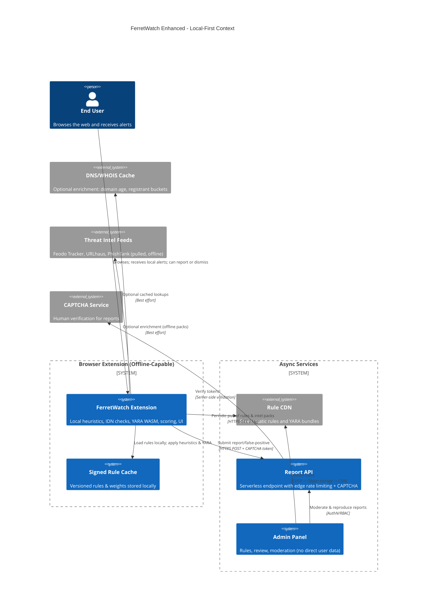

# 🧭 Architecture Views

## C4 Context & Containers (Local-First Emphasis)



## Container Diagram

```mermaid
graph LR
  subgraph Browser (Local-First)
    E[Content Script]\nHeuristics + IDN + YARA
    B[Service Worker]\nRule fetch + storage + scheduling
    U[Popup/Options UI]\nAlerts + Report Form
    C[Local Rule Cache]\nSigned manifest + rules.json + yara.wasm + intel.bloom
  end

  subgraph Cloud (Async/Low-Cost)
    WAF[(Edge WAF + Rate Limit)]
    RAPI[(Serverless Report API)]
    AR[(Admin Panel SPA)]
    DB[(Append-only Report Log)]
    OBJ[(Object Storage)]
    CDN[(CDN Edge Cache)]
  end

  subgraph Optional 3P Enrichment
    WHOIS[DNS/WHOIS Cache]
    INTEL[Threat Intel Cache (Feodo, URLhaus, PhishTank)]
    CAPTCHA[CAPTCHA Verify API]
  end

  E --> C
  B -->|ETag/If-None-Match| CDN
  B -->|download| OBJ
  U -->|submit report + captcha| WAF --> RAPI --> CAPTCHA
  RAPI --> DB
  AR --> OBJ --> CDN
  E -.-> WHOIS
  E -.-> INTEL
```

## Component View (Extension)

- Local Heuristics
  - IDN/homoglyph detection with Unicode confusables map and target brand set; edit distance thresholds
  - Domain freshness: local-first-seen and cert NotBefore heuristic; no blocking on WHOIS
  - Phishing UI heuristics: off-domain form action, hidden inputs, data: URLs, suspicious keywords, favicon mismatch, cross-domain hotlinking not in subdomain tree
  - Asset provenance: logo hash comparisons vs. brand set
- YARA Engine
  - WASM sandbox; time/memory limits; rule tags map to weight categories
- Scoring Engine
  - Weighted sum with confidence; per-signal caps; thresholds from rules.json
  - Explanations: per finding rationale to UI only
- Rule/Intel Manager
  - Signed manifest (version, checksums, signature); staged activation; rollback
  - Background refresh with exponential backoff + jitter; bloom filters for intel packs
- Privacy Guard
  - No raw content exfiltration; only normalized indicators and hashes
  - Opt-in enrichment; default off
- UI
  - Badge color states, detailed panel, Report/False-positive flows, whitelist UI

## Component View (Cloud)

- Report API (serverless)
  - Endpoints: POST /report, POST /false-positive, GET /reports/:id (admin)
  - Protections: CAPTCHA, IP + install-id token buckets, HMAC-signed install token, WAF bot rules
  - Storage: Append-only log; moderation table; evidence references only
- Rule Publishing Pipeline
  - CI builds rules.json, intel.bloom, yara packs; uploads to OBJ; CDN with long TTL; cache-busting filenames + signed manifest
- Admin Panel
  - RBAC; audit log; deterministic reproduction runner using the same rule pack and intel version

## Data Flows (Local-First)

1) Detect locally: Extract -> IDN -> Heuristics/YARA -> Score -> Alert (no network dependency)
2) Refresh rules asynchronously: SW polls manifest via CDN; verify signature; stage & swap
3) Report/False-positive: User submits; CAPTCHA; store evidence; no page content
4) Admin reproduce: Fetch URL in sandbox runner; apply same rules; approve/deny. No domain-pattern-only reports allowed.

## Cost & Abuse Controls

- CDN pull-only; object storage origin; serverless API; edge WAF/rate limit
- Default offline detection; enrichment calls opt-in and cached
- CAPTCHA + token buckets; backpressure responses with Retry-After