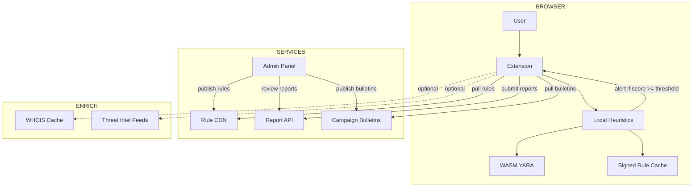

# 🏗️ Architecture Overview

## System Purpose
FerretWatch Enhanced is a privacy-preserving browser extension that detects and alerts users about suspicious web pages through client-side analysis, crowd-sourced threat intelligence, and centralized rule distribution.

## Context Diagram (Local-First, Mermaid 10.9.4 Compatible)

> Local-first detection: all alerts can be generated without network access. Services are used asynchronously for updates and enrichment only.

## Key Constraints

### 🔐 Privacy Constraints
- **Zero PII Collection**: No user browsing history or personal data leaves the browser
- **Reproducible Reports**: Full URL and evidence required; no domain patterns
- **Local Processing**: All detection logic runs client-side

### 💰 Cost Constraints
- **CDN Pull**: Static rule packs, intel filters, and bulletins pulled via CDN; no push infra
- **Serverless APIs**: Report ingestion scales to zero; aggressive rate limiting and CAPTCHA
- **Delta Packs**: Support partial updates to minimize bandwidth

### 🎯 Technical Constraints
- **Manifest V3** and content script limits respected
- **Performance Budget**: < 50 ms average detection per page
- **Offline Capability**: Core detection works offline

## High-Level Architecture Vision
- Client performs detection with cached rules; explains findings and scores locally
- CI builds signed rule packs from sources including FeodoTracker, URLhaus, PhishTank
- CDN distributes packs and bulletins; clients poll with jitter
- Admin console verifies reports, publishes rules and bulletins under two-person control

## Core Design Principles
- Defense in Depth; Eventual Consistency; Fail-Safe Defaults; Evidence-Based Scoring; Reproducible Reports