# 🗺️ User Journeys

## Journey 1: Sarah's Close Call with a Phishing Attack

**Scenario**: Sarah receives an email appearing to be from LinkedIn about a connection request, containing a link to view the profile.

```mermaid
journey
    title Sarah's Phishing Protection Journey
    section Email Arrival
      Receives LinkedIn email: 5: Sarah
      Clicks profile link: 4: Sarah
    section FerretWatch Detection
      Extension detects homograph attack: 5: FerretWatch
      Shows warning - fake LinkedΙn.com: 5: FerretWatch
      Sarah sees clear danger message: 5: Sarah
    section Safe Resolution
      Closes fake site immediately: 5: Sarah
      Reports phishing attempt: 5: Sarah
      Checks real LinkedIn safely: 5: Sarah
```

**Journey Description**: Sarah starts her day checking emails (sentiment: 5/5). She sees what appears to be a LinkedIn connection request and clicks the link without suspicion (sentiment: 4/5). FerretWatch detects domain homograph technique - 