# 🗺️ User Journeys

## Journey 1: Sarah's Close Call with a Phishing Attack

**Scenario**: Sarah receives an email appearing to be from LinkedIn about a connection request, containing a link to view the profile.

```mermaid
journey
    title Sarah's Phishing Protection Journey
    section Email Arrival
      Receives LinkedIn email: 5: Sarah
      Clicks profile link: 4: Sarah
    section FerretWatch Detection
      Extension detects homograph attack: 5: FerretWatch
      Shows warning - fake LinkedΙn.com: 5: FerretWatch
      Sarah sees clear danger message: 5: Sarah
    section Safe Resolution
      Closes fake site immediately: 5: Sarah
      Reports phishing attempt: 5: Sarah
      Checks real LinkedIn safely: 5: Sarah
```

**Journey Description**: Sarah starts her day checking emails (sentiment: 5/5). She sees what appears to be a LinkedIn connection request and clicks the link without suspicion (sentiment: 4/5). FerretWatch detects a homograph attack - 'LinkedΙn.com' with a Greek Iota. The extension shows a high-priority warning. Sarah closes the site, reports the page, and navigates safely to the real LinkedIn.

## Journey 2: Robert's Banking Security Check

**Scenario**: Robert needs to check his bank balance and types his bank's URL with a small typo.

**Journey Description**: Robert wants to check his bank balance online. He types the URL but makes a typo (sentiment: 3/5). He lands on a suspicious page (sentiment: 2/5).
FerretWatch detects multiple issues: domain registered recently, hotlinked images. It shows a simple warning. He follows the safe link and completes banking.

## Journey 3: Alex's Technical Investigation

**Scenario**: Alex's friend sends a Discord link to a 'free game giveaway' that seems suspicious.

**Journey Description**: Alex investigates suspicious Discord link; YARA matches; reports with technical notes; administrators update rules.

## Journey 4: Maria's Business Protection

**Scenario**: Maria receives an invoice email from a supplier with a link.

**Journey Description**: Maria almost paid scammers; she reports, shares warning, and whitelists the real portal.

## Journey 5: Administrator's Emergency Response

**Scenario**: A new phishing campaign emerges; rapid response.

**Journey Description**: Admin develops, reviews, and deploys rules with two-person approval; users protected quickly.